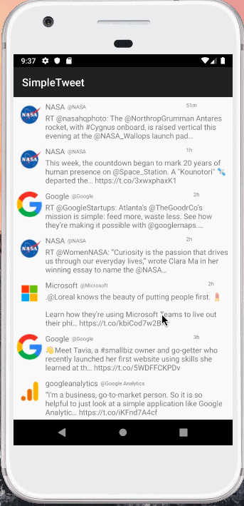

# Project 1 - *Simple Tweet*

**Simple Tweet** is an android app that allows users to view a Twitter client that display their Twitter feed.

Submitted by: **M. Flynn**

Time spent: **5** hours spent in total

## User Stories

The following **required** functionality is completed:

* [x] User can **sign in to Twitter using OAuth login**
* [x] User can **view the tweets from their home timelines**
* [x] User's **refresh tweets timeline by pulling down to refresh** 

## Video Walkthrough

Here's a walkthrough of implemented user stories:

GIF created with [LiceCap](http://www.cockos.com/licecap/).

## Notes

Describe any challenges encountered while building the app.

## License

    Copyright [yyyy] [name of copyright owner]

    Licensed under the Apache License, Version 2.0 (the "License");
    you may not use this file except in compliance with the License.
    You may obtain a copy of the License at

        http://www.apache.org/licenses/LICENSE-2.0

    Unless required by applicable law or agreed to in writing, software
    distributed under the License is distributed on an "AS IS" BASIS,
    WITHOUT WARRANTIES OR CONDITIONS OF ANY KIND, either express or implied.
    See the License for the specific language governing permissions and
    limitations under the License.
